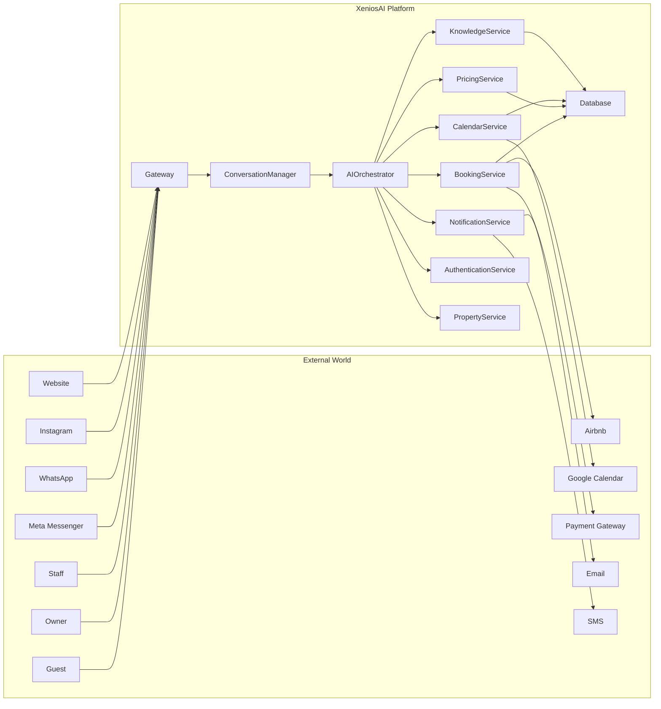

# ARCH-001 · Chapter 04 — System Context

**Document ID:** ARCH-001-04

**Title:** System Context

**Version:** 1.0

**Status:** Draft

**Owner:** Architecture

**Last Updated:** 2026-07-13

**Parent Document:** ARCH-001 — System Overview

---

# Purpose

This document defines the external environment in which XeniosAI operates.

Rather than describing internal implementation details, it identifies the people, systems, services, and external platforms that interact with XeniosAI.

This chapter establishes the platform boundary.

---

# Overview

XeniosAI acts as the operational intelligence layer of a hospitality business.

It sits between guests, staff, business systems, and third-party platforms.

The platform receives requests, coordinates backend services, retrieves knowledge, executes business workflows, and communicates results back to users.

---

# System Boundary

Everything inside the XeniosAI boundary is controlled by XeniosAI.

Everything outside represents external actors or third-party services.

---

# Primary Actors

## Guest

The primary consumer of the platform.

Guests interact through conversational interfaces.

Typical actions include:

* Availability inquiries
* Pricing requests
* Reservation requests
* Booking modifications
* FAQs
* Support requests

Guests should never need to understand the underlying services.

---

## Property Owner

Responsible for:

* Pricing
* Policies
* Property configuration
* Business rules
* Analytics
* Operational oversight

Owners configure the platform rather than modify its code.

---

## Staff

Staff members manage operational exceptions including:

* Manual reservations
* Guest disputes
* Escalations
* Maintenance updates
* Special requests

Staff should work alongside AI rather than compete with it.

---

# External Systems

## Communication Platforms

Supported communication channels include:

* Facebook Messenger
* WhatsApp
* Instagram
* Website chat
* Future messaging providers

These platforms deliver conversations but do not contain business logic.

---

## Calendar Providers

Calendar systems synchronize:

* Availability
* Reservations
* Maintenance blocks
* External bookings

Examples:

* Google Calendar
* Airbnb Calendar (iCal)
* Future PMS integrations

---

## Payment Providers

Responsible for:

* Payment authorization
* Payment confirmation
* Refund processing

Payments remain external to XeniosAI.

The platform records payment status but does not implement payment processing.

---

## Online Travel Agencies (OTAs)

Future integrations include:

* Airbnb
* Booking.com
* Agoda
* Expedia

OTA integrations synchronize:

* Reservations
* Availability
* Calendar updates

---

# Internal Responsibilities

Within the platform boundary XeniosAI is responsible for:

* Conversation management
* AI reasoning
* Knowledge retrieval
* Booking orchestration
* Pricing coordination
* Notification workflows
* Authentication
* Operational analytics

---

# Platform Responsibility Matrix

| Capability               | XeniosAI | External        |
| ------------------------ | -------- | --------------- |
| Conversation             | ✅        |                 |
| Booking orchestration    | ✅        |                 |
| Knowledge retrieval      | ✅        |                 |
| Calendar synchronization | ✅        | Google / Airbnb |
| Payment processing       |          | ✅               |
| Messaging transport      |          | ✅               |
| AI reasoning             | ✅        | LLM Provider    |
| Business rules           | ✅        |                 |
| Property configuration   | ✅        |                 |

---

# Design Principles

Several architectural principles emerge from this context:

## Separation of Responsibilities

External providers own transport.

XeniosAI owns orchestration.

---

## Single Source of Truth

Business rules should exist only inside XeniosAI.

External platforms should never become the primary source of business knowledge.

---

## Provider Independence

Replacing one provider should not require redesigning the platform.

Examples include:

* AI provider
* Messaging gateway
* Payment provider
* Calendar provider

---

## Configuration over Customization

Every property should configure XeniosAI through data rather than modifying platform code.

---

# Future Expansion

The architecture intentionally leaves room for future integrations such as:

* Voice assistants
* Smart locks
* IoT sensors
* Dynamic pricing engines
* Revenue management systems
* Housekeeping systems
* Maintenance systems
* CRM platforms

The platform boundary should remain stable even as new integrations are added.

---

# Context Summary

XeniosAI is positioned as the central operational intelligence layer of the hospitality business.

It coordinates interactions between:

* Guests
* Property owners
* Staff
* AI providers
* Messaging platforms
* Booking systems
* Calendar providers
* Payment services

while maintaining ownership of business logic and operational knowledge.

---

# Related Documents

* ARCH-001-01 — Vision
* ARCH-001-02 — Problem Statement
* ARCH-001-03 — Goals
* ARCH-001-05 — High-Level Architecture
* ARCH-002 — Platform Layers
* ARCH-003 — Service Map
