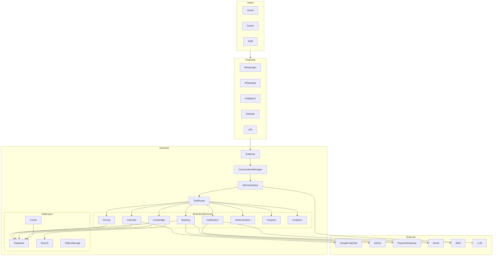

# ARCH-001 · Chapter 05 — High-Level Architecture

**Document ID:** ARCH-001-05

**Title:** High-Level Architecture

**Version:** 1.0

**Status:** Draft

**Owner:** Architecture

**Last Updated:** 2026-07-13

**Parent Document:** ARCH-001 — System Overview

---

# Purpose

This document defines the overall architecture of the XeniosAI platform.

It describes the major components, how they interact, and the architectural principles that govern communication between them.

This chapter intentionally omits implementation details, APIs, and database schemas. Those topics are covered in later architecture specifications.

---

# Architecture Philosophy

XeniosAI is designed as a modular, AI-native platform built around service orchestration.

Rather than embedding business logic inside conversational AI, XeniosAI separates responsibilities into independent layers:

* Communication
* Orchestration
* Business Services
* Data
* External Integrations

The AI coordinates these layers but never replaces them.

---

# Platform Overview



---

# Architectural Layers

The platform consists of six logical layers.

## Layer 1 — Experience Layer

Responsible for user interaction.

Components include:

* Facebook Messenger
* WhatsApp
* Instagram
* Website Chat
* REST API
* Mobile Applications

No business logic exists in this layer.

---

## Layer 2 — Gateway Layer

Responsible for:

* Authentication
* Request validation
* Rate limiting
* Channel normalization
* Session creation

Every request enters XeniosAI through this layer.

---

## Layer 3 — Intelligence Layer

The Intelligence Layer contains:

* Conversation Manager
* AI Orchestrator
* Context Builder
* Prompt Manager
* Tool Router

This is the reasoning layer of the platform.

It understands requests but does not execute business logic.

---

## Layer 4 — Business Services

Business Services own deterministic behavior.

Examples include:

* Booking
* Pricing
* Calendar
* Knowledge
* Notifications
* Property Management
* Authentication
* Analytics

Every business capability should belong to exactly one service.

---

## Layer 5 — Data Layer

Persistent storage includes:

* Relational Database
* Cache
* Search Index
* Object Storage
* Future Vector Database

Business services own their data.

Direct database access from AI is prohibited.

---

## Layer 6 — Integration Layer

External systems include:

* Meta
* WhatsApp
* Instagram
* Airbnb
* Google Calendar
* Payment Providers
* Email Providers
* SMS Providers
* AI Providers

Integrations communicate through adapters.

---

# Request Lifecycle

Every request follows the same path.

```text
Guest

↓

Channel

↓

Gateway

↓

Conversation Manager

↓

AI Orchestrator

↓

Tool Router

↓

Business Service

↓

Database

↓

Business Service

↓

AI Orchestrator

↓

Guest
```

Consistency in this lifecycle simplifies debugging, monitoring, and future expansion.

---

# Core Components

## Gateway

Receives and validates requests from every communication channel.

---

## Conversation Manager

Maintains conversation state and session lifecycle.

---

## AI Orchestrator

Coordinates reasoning, context assembly, and tool execution.

---

## Tool Router

Determines which business service should process a request.

---

## Business Services

Execute deterministic operations.

Business Services never call the LLM directly.

---

## Data Layer

Stores operational data and business knowledge.

Business Services own persistence.

---

## External Adapters

Encapsulate communication with third-party providers.

Changing providers should affect adapters rather than core services.

---

# Design Rules

The following rules apply to the entire platform.

## Rule 1

AI must never directly modify persistent data.

---

## Rule 2

Every business operation must pass through a business service.

---

## Rule 3

Every service owns its own business capability.

---

## Rule 4

Services communicate through defined interfaces.

---

## Rule 5

External providers are replaceable.

---

## Rule 6

Configuration replaces customization whenever possible.

---

## Rule 7

Business rules remain deterministic.

---

# Scalability Strategy

The architecture is designed for horizontal growth.

Possible scaling dimensions include:

* More users
* More conversations
* More AI requests
* More properties
* More integrations
* More services

New capabilities should be introduced by adding services rather than modifying unrelated components.

---

# Technology Independence

This architecture intentionally avoids selecting specific technologies.

Examples:

* Programming language
* Database engine
* AI provider
* Cloud platform
* Container runtime

These decisions belong to implementation specifications rather than architecture.

---

# Quality Attributes

The architecture prioritizes:

* Modularity
* Reliability
* Maintainability
* Extensibility
* Observability
* Security
* Vendor Independence
* Performance
* Scalability

Every future implementation should improve these attributes rather than compromise them.

---

# Summary

The XeniosAI platform is composed of:

* Experience Layer
* Gateway Layer
* Intelligence Layer
* Business Services
* Data Layer
* Integration Layer

Each layer has a clearly defined responsibility and communicates only through established interfaces.

This separation enables the platform to evolve without introducing unnecessary coupling.

---

# Related Documents

* ARCH-001-04 — System Context
* ARCH-001-06 — Design Principles
* ARCH-002 — Platform Layers
* ARCH-003 — Service Map
* ARCH-004 — AI Orchestrator
